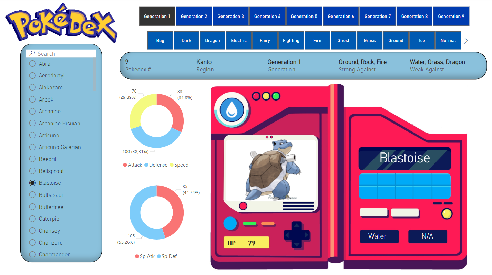

# Pokedex
Pokemon data Web Scraping and Visualizations 

## Table of Contents
* [General Info](#general-information)
* [Technologies Used](#technologies-used)
* [Screenshots](#screenshots)
* [Project Status](#project-status)
* [Room for Improvement](#room-for-improvement)

## General Information
- Power BI dashboard in form of interactive 'Pokedex'
- Dataset has been web scraped from https://pokemondb.net/pokedex/all (stats) and https://pokemon-go.name/en/pokemony/ (images)

## Technologies Used
- Python - version 3.11
- Microsoft Power BI

## Screenshots

## Project Status
Project is: _in progress_ 

## Room for Improvement
Working on better web scraping script and include in dataset images for regional form Pokemons.

